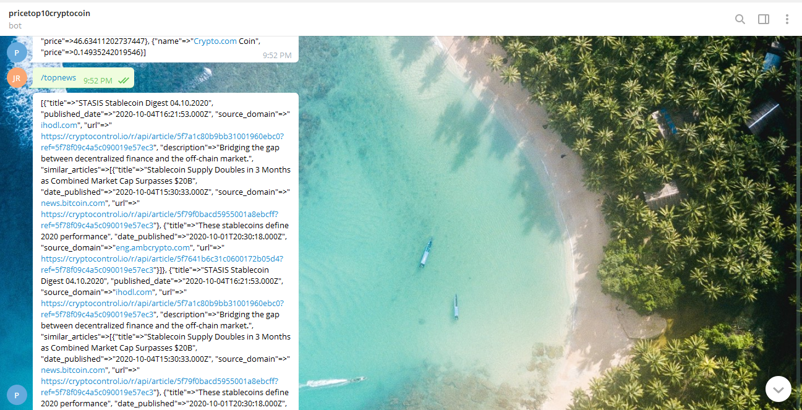

# Ruby Capstone Telegram Bot

The Microverse Capstone project for the Ruby module called "Build your own Bot" where I have to build a bot from one platform either Slack, Twitter or Telegram. I've choosen to build a bot from Telegram that gives me the price of the top 10 crypto currencies by making an API call to the coinmarketcap API and providing the latest news, tweets and reddits post by using the gem crypto-news-api.

For this implementation of a Telegram Bot I created 2 classes and the main file where it runs the connection to the Bot. The files are:

- The Crypto Info class that initializes with the url for the coinmarketcap API, the url instance variable has the getter and setter methods. It has the public method looping_top_10_listings that loops over the array of hashes returned by the private method top_10_listings. The private methods are top_10_listings and latest_listings top_10_listings is in charge of calling the latest_listings and taking the hash that comes from that call and by creating a new array it gets the right data needed and stored it on a new array, returninng the new array as output. The latest_listings private method is in charge of defining the endpoint for the API call and pass it onto the get_request private method that makes the API call.

- The Crypto News this class was build with the API from crypto-news-api gem, initializes defining the environment variable for API key. It has the public methods looping_on_news, looping_top_news_by_coin, looping_top_tweets_by_coin and looping_top_reddits_by_coin, and the private methods top_news, top_news_by_coin, top_tweets_by_coin, top_reddits_by_coin and top_5. The public methods with the looping_ at the begginig of the name only does 1 function and it's looping over the array returned by the private methods that are in charge of connecting everything for the API call. This is done so the data can be display more user friendly over the telegram channel. For the private methods, top_news calls the getTopNews from the gem, and pass the resulting hash to the method top_5, for top_news_by_coin methods does the same as the previous method, calling the getTopNewsByCoin from the gem but it takes a coin as an argument. The top_tweets_by_coin method calls the getTopTweetsByCoin from the gem and through a while loop it gets the data needed from the returning hash and save it into an array to output that array. The previous methodology is the same applied in the methods top_reddits_by_coin.

- The main file has the connection to the Bot Client from Telegram. It opens the connection and through a case when conditional it instantiate an object form the other classes and call the respective method depending in the user command choice.

## Built With
- Ruby programming language
- VsCode
- Telegram channel BotFather

### Ruby standards libraries:
- uri
- net/http

### Gem libraries:
- bundler
- dotenv
- json
- telegram-bot-ruby
- crypto-news-api

### Documentations
- https://docs.ruby-lang.org/
- https://core.telegram.org/bots/api
- https://coinmarketcap.com/api/documentation/v1/
- https://www.rubydoc.info/gems/crypto-news-api/
- https://api-docs.cryptocontrol.io/
- https://hackernoon.com/how-to-create-a-telegram-bot-using-ruby-n7ag32c1

## Author

- 👤GitHub: [Jose Abel Ramirez](https://github.com/jose-Abel)
- Linkedin: [Jose Abel Ramirez Frontany](https://www.linkedin.com/in/jose-abel-ramirez-frontany-7674a842/)

## Setup
You can either copy the code with git clone or with any other method and run it on your local environment. The .env file was added so anyone that downloads this code can run it with the following commands:

- git clone https://github.com/jose-Abel/Ruby-Capstone-Telegram-Bot.git
- cd Ruby-Capstone-Telegram-Bot
- bin/main.rb (For Linux or Mac users)
- ruby bin/main.rb (For Windows users)
Once running have to go to the Telegram Channel 'pricetop10cryptocoin' to run the commands that makes the functionality

## Getting Started
In order to run this bot, if you want to have your own channel for it and your own API keys, after cloning this repository and get inside the root of the repository, create a .env file in the root of this project. Assigned 3 variable for the 3 API keys in the .env file, the API keys are the telegram token, the coinmarketcap API key and the crypto-news-api key.

### Telegram Token
Go to the Telegram Channel 'BotFather' and tyoe the command '/newbot'. The BotFather'll asked for the name of the bot, that will be the channel you visit it to run it, after you type it 'll asked for a username, after you type for a username BotFather'll send you a message that includes the HTTP API key needed for next instructions.

###  coinmarketcap API Key
Go to https://www.coinmarketcap.com and choose to sign up to create a new free account. After that is done click in Products tab and then in Crypto API. It will take you to the Dashboad for developers and then hover the mouse in the field below API Key and will display a button named COPY KEY, once clicked the message in the button changed to Copied! and that is the API key needed for next instructions.

### cryptocontrol.io API Key
Go to https://wwww.cryptocontrol.io/en/developers/apis and choose to sign up to create a new free account. After done click in the button GET API KEY and it will show you an API key needed for next instructions.

### Running the Bot
The 3 previous keys has to be stored in variables in the .env file with the following names TELEGRAM_TOKEN_KEY for the telegram token, COINMARKETCAP_API for the coinmarketcap API key and CRYPTO_NEWS for the crypto news API key. Then run 'bin/main.rb' in Unix OS such as Linux or Mac and 'ruby bin/main.rb' in Windows. After all the previous is done, visit the Telegram channel with the name you choose before for the bot and run the command /start.

This Telegram Bot has the following commands:

/start : Run the program starting the bot

/price : Show the price of the top 10 cryptocurrencies

/topnews : Show the top 5 news of all of the cryptocurrencies combined

/tncbitcoin : Show the top 5 news of bitcoin 

/tncethereum : Show the top 5 news of ethereum 

/tnctether : Show the top 5 news of tether 

/tncripple : Show the top 5 news of ripple

/ttcbitcoin : Show the top 5 tweets of bitcoin

/ttcethereum : Show the top 5 tweets of ethereum

/ttctether : Show the top 5 tweets of tether

/ttcripple : Show the top 5 tweets of ripple

/trcbitcoin : Show the top 5 reddit posts of bitcoin

/trcethereum : Show the top 5 reddit posts of ethereum

trcbinancecoin : Show the top 5 reddit posts of binance coin

/trcripple : Show the top 5 reddit posts of ripple

## Run tests
Run the tests for the linters.yml and rubocop and everything passed. The instructions to setup this tests are at this repository: [Rubocop instructions](https://github.com/microverseinc/linters-config/tree/master/ruby)

For the linters, this tests runs once you make a PR, if you have it in the respective folder. In order to have this tests, after cloning this project:
 - cd Ruby-Capstone-Telegram-Bot
- From the root of this project create the folders .github/workflows
- Add a copy of [.github/workflows/tests.yml](https://github.com/microverseinc/linters-config/blob/master/ruby/.github/workflows/tests.yml) to the .github/workflows

To download rubocop and run the tests on your local environment, this are the commands to type in the Linux, Mac terminal or Windows cmd:
- gem 'rubocop'
- cd Ruby-Capstone-Telegram-Bot
- copy this file [.rubocop.yml](https://github.com/microverseinc/linters-config/blob/master/ruby/.rubocop.yml) in the root directory of the project
- type in the terminal 'rubocop'

The commands to install and run rspecs in the Linux, Mac terminal or Windows cmd are:

- gem install rspec
- cd Ruby-Capstone-Telegram-Bot
- rspec --init
After creating the tests, to run them from the root directory:
- rspec

## Acknowledgments
Appreciate the Ruby Team, and a special acknowledgment to Microverse for pushing us further into accomplishing our goals.

## 📝 License
This project is MIT licensed.

## Show your support
Give a ⭐️ if you like this project!
