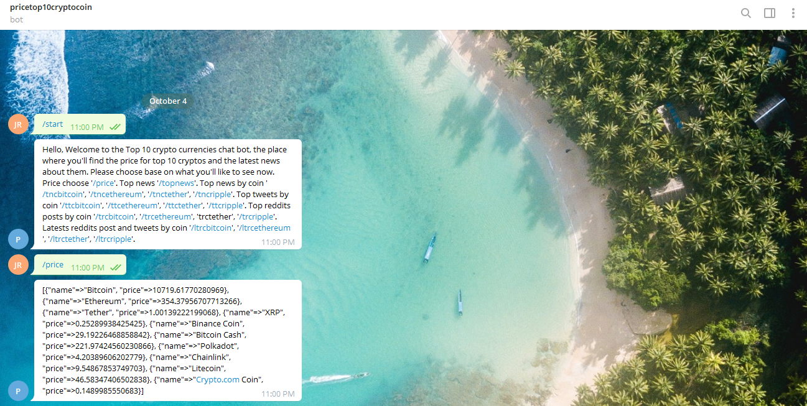
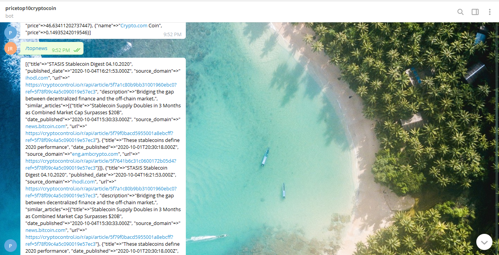
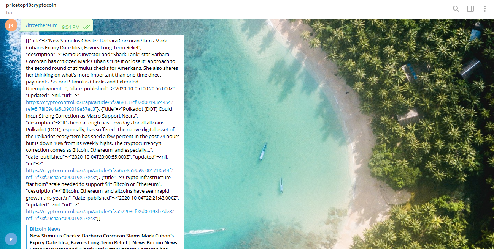

# Ruby Capstone Telegram Bot

The Microverse Capstone project for the Ruby module called "Build your own Bot" where I have to build a bot from one platform either Slack, Twitter or Telegram. I've choosen to build a bot from Telegram that gives me the price of the top 10 crypto currencies by making an API call to the coinmarketcap API and providing the latest news, tweets and reddits post by using the gem crypto-news-api.

The Telegram Bot I created has the following commands:

/start : To run the program starting the bot

/price : To show the price of the top 10 cryptocurrencies

/topnews : To show the top 3 news of all of the cryptocurrencies combined

/tncbitcoin : Show the top 3 news of bitcoin 

/tncethereum : Show the top 3 news of ethereum 

/tnctether : Show the top 3 news of tether 

/tncripple : Show the top 3 news of ripple

/ttcbitcoin : Show the top 3 tweets of bitcoin

/ttcethereum : Show the top 3 tweets of ethereum

/ttctether : Show the top 3 tweets of tether

/ttcripple : Show the top 3 tweets of ripple

/trcbitcoin : Show the top 3 reddit posts of bitcoin

/trcethereum : Show the top 3 reddit posts of ethereum

trctether : Show the top 3 reddit posts of tether

/trcripple : Show the top 3 reddit posts of ripple

/ltrcbitcoin : Show the latest 3 reddit comments and tweets posts of bitcoin

/ltrcethereum : Show the latest 3 reddit comments and tweets posts of ethereum

/ltrctether : Show the latest 3 reddit comments and tweets posts of tether

/ltrcripple : Show the latest 3 reddit comments and tweets posts of ripple

## Built With
- Ruby programming language
- VsCode
- Telegram channel BotFather

### Ruby standards libraries:
- uri
- net/http

### Gem libraries:
- bundler
- dotenv
- json
- telegram-bot-ruby
- crypto-news-api

### Documentations
- https://docs.ruby-lang.org/
- https://core.telegram.org/bots/api
- https://coinmarketcap.com/api/documentation/v1/
- https://www.rubydoc.info/gems/crypto-news-api/
- https://hackernoon.com/how-to-create-a-telegram-bot-using-ruby-n7ag32c1

## Author

- 👤GitHub: [Jose Abel Ramirez](https://github.com/jose-Abel)
- Linkedin: [Jose Abel Ramirez Frontany](https://www.linkedin.com/in/jose-abel-ramirez-frontany-7674a842/)

## Getting Started
You can clone this code anytime and run it with the Ruby interpreter in the Windows console or Unix terminal by typing 'ruby bin/main.rb' or it can run in Unix OS by typing 'bin/main.rb' in the terminal, without the 'ruby' interpreter command, since the main file has the shebang instruction at the top that makes it an executable file.

### Setup
You can either copy the code with git clone or with any other method and run it on your local environment. The commands to clone it and then run the game are:
- git clone https://github.com/jose-Abel/Ruby-Capstone-Telegram-Bot.git
- cd Ruby-Capstone-Telegram-Bot
- bin/main.rb (if you are in Linux or Mac)
- ruby bin/main.rb (for Windows)

### Run tests
Run the tests for the linters.yml and rubocop and everything pass. The instructions to setup this tests are at this repository: [Rubocop instructions](https://github.com/microverseinc/linters-config/tree/master/ruby)

For the linters, this tests runs once you make a PR, if you have it in the respective folder. In order to have this tests, after cloning this project:
 - cd Ruby-Capstone-Telegram-Bot
- From the root of this project create the folders .github/workflows
- Add a copy of [.github/workflows/tests.yml](https://github.com/microverseinc/linters-config/blob/master/ruby/.github/workflows/tests.yml) to the .github/workflows

To download rubocop and run the tests on your local environment, this are the commands to type in the Linux, Mac terminal or Windows cmd:
- gem 'rubocop'
- cd Ruby-Capstone-Telegram-Bot
- copy this file [.rubocop.yml](https://github.com/microverseinc/linters-config/blob/master/ruby/.rubocop.yml) in the root directory of the project
- type in the terminal 'rubocop'

The commands to install and run rspecs in the Linux, Mac terminal or Windows cmd are:

- gem install rspec
- cd Ruby-Capstone-Telegram-Bot
- rspec --init
After creating the tests, to run them from the root directory:
- rspec

### Acknowledgments
Appreciate the Ruby Team, and a special acknowledgment to Microverse for pushing us further into accomplishing our goals.

## 📝 License
This project is MIT licensed.

## Show your support
Give a ⭐️ if you like this project!