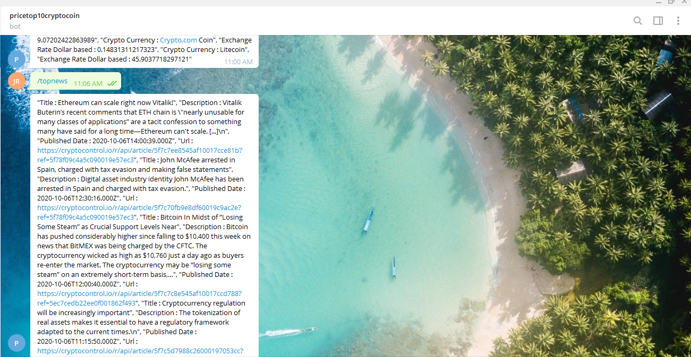

# Ruby Capstone Telegram Bot

The Microverse Capstone project for the Ruby module called "Build your own Bot" where I have to build a bot from one platform either Slack, Twitter or Telegram. I've choosen to build a bot from Telegram that gives me the price of the top 10 crypto currencies by making an API call to the coinmarketcap API and providing the latest news and news per each coin of the top 10 cryptos through the cryptopanic.com API.

For this implementation of a Telegram Bot I created 2 classes and the main file where it runs the connection to the Bot. The files are:

- The Crypto Info class that initializes with the url for the coinmarketcap API, the url instance variable has the getter and setter methods. It has the public method looping_top_10_listings that loops over the array of hashes returned by the private method top_10_listings. The private methods are top_10_listings and latest_listings, top_10_listings is in charge of calling the latest_listings and taking the hash that comes from that call and by creating a new array it gets the right data needed and stored it on a new array, returninng the new array as output. The latest_listings private method is in charge of defining the endpoint for the API call and pass it onto the get_request private method that makes the API call.

- The Crypto News this class was build with the API from https://cryptopanic.com, initializes defining the environment variable for API key. It has the public methods get_latest_news and get_individual_crypto and the private method get_request. The public methods are in charge of calling the get_request private method to do the HTTP request to the API, and then processing the returned hash to push into an array of strings that will represent the message that the Telegram Bot will sent in the message.

- The main file has the connection to the Bot Client from Telegram. It opens the connection and through a case when conditional it instantiate an object form the other classes and call the respective method depending in the user command choice.

## Built With

- Ruby programming language
- VsCode
- Telegram channel BotFather

### Ruby standards libraries:

- uri
- net/http

### Gem libraries:

- bundler
- dotenv
- json
- telegram-bot-ruby

### Documentations

- https://docs.ruby-lang.org/
- https://core.telegram.org/bots/api
- https://coinmarketcap.com/api/documentation/v1/
- https://cryptopanic.com/developers/api/
- https://medium.com/@jamezjaz/how-to-deploy-ruby-bot-live-on-heroku-b4fbab282445
- https://hackernoon.com/how-to-create-a-telegram-bot-using-ruby-n7ag32c1

## Author

- 👤GitHub: [Jose Abel Ramirez](https://github.com/jose-Abel)
- Linkedin: [Jose Abel Ramirez Frontany](https://www.linkedin.com/in/jose-abel-ramirez-frontany-7674a842/)

## Live Version

[live version](https://t.me/Price10CryptoBot)

## Setup

You can either copy the code with git clone or with any other method and run it on your local environment. The .env file was added so anyone that downloads this code can run it with the following commands:

- git clone https://github.com/jose-Abel/Ruby-Capstone-Telegram-Bot.git
- cd Ruby-Capstone-Telegram-Bot
- sudo bin/main.rb (For Linux or Mac users)
- ruby bin/main.rb (For Windows users)
- Once running have to go to the Telegram Channel 'pricetop10cryptocoin' to run the commands that makes the functionality

## Getting Started

In order to run this bot, if you want to have your own channel for it and your own API keys, after cloning this repository and get inside the root of the repository, create a .env file in the root of this project. Assigned 3 variable for the 3 API keys in the .env file, the API keys are the telegram token, the coinmarketcap API key and the cryptopanig API key.

### Telegram Token

Go to the Telegram Channel 'BotFather' and tyoe the command '/newbot'. The BotFather'll asked for the name of the bot, that will be the channel you visit it to run it, after you type it 'll asked for a username, after you type for a username BotFather'll send you a message that includes the HTTP API key needed for next instructions.

### coinmarketcap API Key

Go to https://www.coinmarketcap.com and choose to sign up to create a new free account. After that is done click in Products tab and then in Crypto API. It will take you to the Dashboad for developers and then hover the mouse in the field below API Key and will display a button named COPY KEY, once clicked the message in the button changed to Copied! and that is the API key needed for next instructions.

### cryptopanic API Key

Go to https://cryptopanic.com/developers/api/ and choose to sign up to create a new free account. After done copy the API KEY below "Your free API auth token" message.

### Running the Bot

The 3 previous keys has to be stored in variables in the .env file with the following names TELEGRAM_TOKEN_KEY for the telegram token, COINMARKETCAP_API for the coinmarketcap API key and CRYPTO_NEWS for the crypto news API key.

Then run 'sudo bin/main.rb' in Linux or Mac and 'ruby bin/main.rb' in Windows. After all the previous is done, visit the Telegram channel with the name you choose before for the bot and run the command /start.

This Telegram Bot has the following commands:

/start : Run the program starting the bot

/price : Show the price of the top 10 cryptocurrencies

/topnews : Show the top 10 news of all of the cryptocurrencies combined

/tncbitcoin : Show the top 10 news of bitcoin

/tncethereum : Show the top 10 news of ethereum

/tnctether : Show the top 10 news of tether

/tncripple : Show the top 10 news of ripple

/tncpolkadot : Show the top 10 news of polkadot

/tnccardano : Show the top 10 tweets of cardano

/tncchainlink : Show the top 10 news of chainlink

/tnclitecoin : Show the top 10 news of litecoin

/tncbinancecoin : Show the top 10 news of binance coin

/tncstellar : Show the top 10 news of stellar

## Run Rspecs

The commands to install and run rspecs in the Linux, Mac terminal or Windows cmd are:

- After cloning this project with the command git clone https://github.com/jose-Abel/Ruby-Capstone-Telegram-Bot.git
- cd Ruby-Capstone-Telegram-Bot
- rspec --init (To initialize rspec on the project, but this repository already has rspec initialize so can go over this step)
  After creating the tests, to run them from the root directory, in the terminal type:
- rspec

## Run linters

For the linters, this tests runs once you make a PR, if you have it in the respective folder. In order to have this tests, after cloning this project:

- cd Ruby-Capstone-Telegram-Bot
- From the root of this project create the folders .github/workflows
- Add a copy of [.github/workflows/tests.yml](https://github.com/microverseinc/linters-config/blob/master/ruby/.github/workflows/tests.yml) to the .github/workflows

## Run Rubocop tests

The instructions to setup this tests are at this repository: [Rubocop instructions](https://github.com/microverseinc/linters-config/tree/master/ruby)

To download rubocop and run the tests on your local environment, this are the commands to type in the Linux, Mac terminal or Windows cmd:

- gem 'rubocop'
- cd Ruby-Capstone-Telegram-Bot
- copy this file [.rubocop.yml](https://github.com/microverseinc/linters-config/blob/master/ruby/.rubocop.yml) in the root directory of the project
- type in the terminal 'rubocop'

## Acknowledgments

Appreciate the Ruby Team, and a special acknowledgment to Microverse for pushing us further into accomplishing our goals.

## 📝 License

This project is MIT licensed.

## Show your support

Give a ⭐️ if you like this project!
